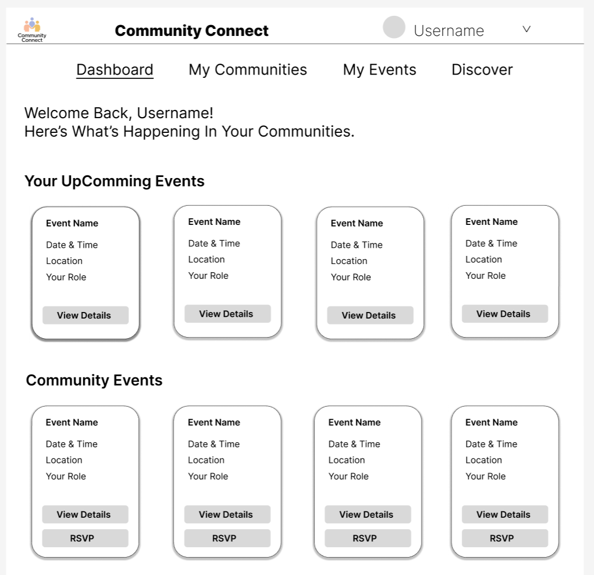

# Community-Connect
David koh - CPT Assessment task 3

## Week 1 - Project Definition

### Project Description
This project is a web application which will allow users to connect and interact with a socila network. Specifically, this web app called "Community Connect" is an application for users to organise IRL events for their communities. Users should also be able to browse and discover new communities. The project will have a range of functional and non-functional requirements, and should be completed in phases with the client (using a hybrid WAgile project style) to design and develop their dream social network application.

### Functional Requirements
- Users should be able to log in and sign up with a username and password
- Users should be able to create and join communities and events
- Users should be able to comment and RSVP on events they are involved in
- Users should be able to check what communities they are part of and the events they are involved in

### Non-Functional Requirements
- The system should repond to user inputs within 3 seconds
- System should be able to load events relevant to the user e.g. relevant to area
- App should be aesthetically pleasing and easy to navigate
- The server should be able to maintain data for atleast 100 different events and communities

## Week 2 - Basic Design of UI, Hierachy and Interactive Elements

### Navigation
Navigation will be through a range of menus, buttons, tabs, etc. Most of the navigation will be through a side menu, though the home page will contain most of the infomation/"pages" that you can choose between using the tabs in the top. There will be a drop down menu next to the profile picture in the top right in order to navigate through personal things such as settings, profile, etc. A main responsive side bar menu will act as the main navigation between major pages (Home page, Communities page, Events page, Browse pag, and Pinned pages).

### Design Choices
| **Design Choice** | **Justification** |
|---|---|
| Colour Palette | A light, muted colour palette was chosen to create website environment or aesthetic of Calmness, Sophistication and Invitation. Muted colours are easier on the eyes, and evoke a sense of peace and relaxation, which is perfect for my webapp. A lighter version of this colour palette was implemented to give a more inviting, homey feel to the website.|
| Font and Typography | The font Inter was used for most text, as its minimalistic feel and easy to read nature makes it best suited for my webapp aesthetic. Important texts are bolded to different degrees based on the importance, in order to make certain element of the webapp more salient. | 
| Image/Icon Choice | On most major pages, Icons and Pages are limited, except for the web logo, profile picture, etc. This supports the minimalistic design of the webapp. On community and event pages, the creators will be able to set background pictures.| 

### Designs:
Home Page:

Landing Page:

Sign Up Page:

Log In Page: 

## Week 3 - Alternative Website Designs

### Data Flow
1. Landing Page (Entry Point)
    - User Action: Arrives at the website.
    - New User: Click "Sign Up" --> [Sign Up Page]
    - Returning User: Click "Log In" --> [Login Page]

2. Sign Up & Login Pages
    - User Action: Submits a form to create an account or log in.
    - Data Flow: Credentials are sent to the Database.
        - If valid, the user is authenticated.
        - Next Step: Redirects the user to the Logged-In Home Page.

3. Logged-In Home Page (Dashboard)
    - User Action: Views personalized information and a community overview.
    - Data Flow: Displays data pulled from the Database, including:
        - User-Specific Events: Events they are organizing or attending.
        - Community Events: Events taking place in communitites they are a part of, but have not RSVP'ed for
    - Flow:
        - Click an Event Card --> [Event Details Page]
        - Click on drop down menu icon --> [Drop Down Menu]
        - Click on a drop down menu option --> [Change Page]

### Alternate Designs
Home Page:

Home Page2:

Landing & Login Page:

